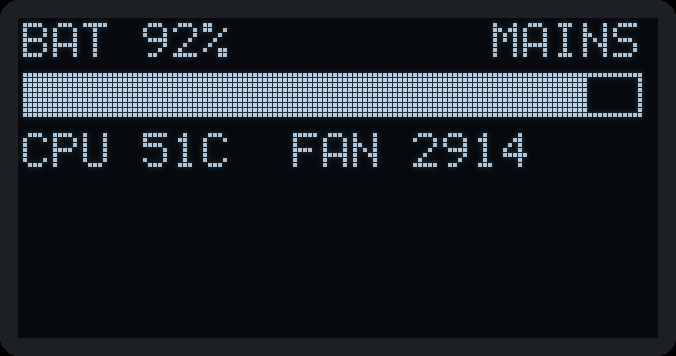
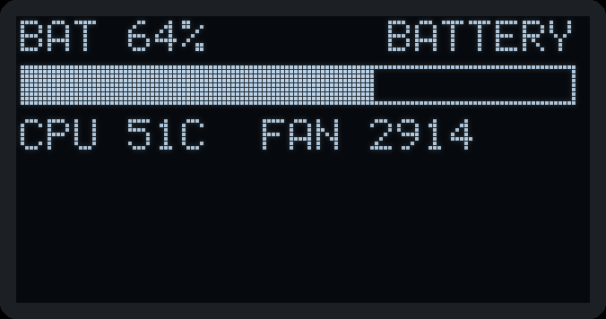
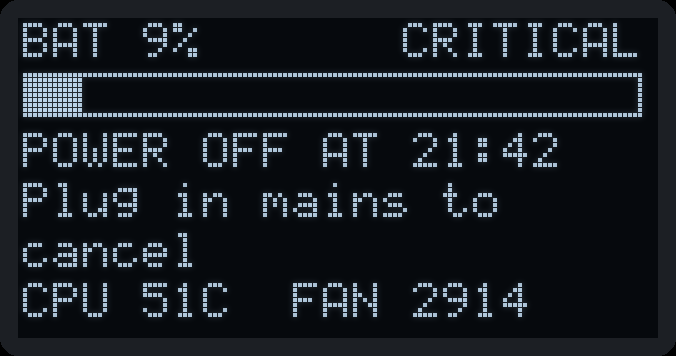
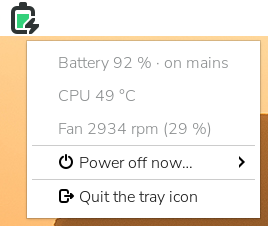
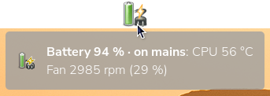
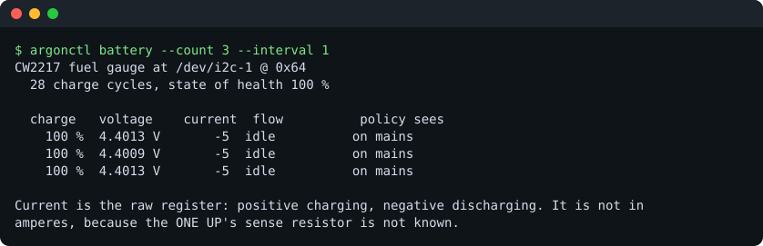

# argon-utils

**Open, safe control software for Argon40's Raspberry Pi cases, the Argon PWR UPS and the Argon
ONE UP laptop** — written in Rust, licensed GPL-3.0-or-later, and built clean-room from published
documentation and measurements of real hardware.

Argon40's own tools are Python scripts installed by a `curl | bash` script, with no licence at
all. `argon-utils` replaces them with a daemon you can trust around your power supply, a CLI with
machine-readable output, a panel icon, and a Debian package.

> **Status:** in daily use on a Raspberry Pi 5 in an Argon ONE V5 with the PWR UPS, and on an Argon
> ONE UP laptop that it has taken over from the vendor's software. Every claim below says how it
> was verified — see [Evidence tiers](#evidence-tiers).

**Project page: <https://dc0sk.github.io/argon-utils/>**

[](https://www.paypal.com/donate/?hosted_button_id=WY9U4MQ3ZAQWC)

<p align="center">
  
  
  
</p>
<p align="center"><sub>The ONE V5's case display, rendered by the same code argond runs, from example readings.</sub></p>

<p align="center">
  
  &nbsp;
  
</p>
<p align="center">
  
</p>

## Features

**Power**

- **UPS monitoring** — charge, mains or battery, read over the Argon PWR UPS's serial protocol and
  published to the tray, the OLED, desktop notifications and a D-Bus service.
- **Safe low-battery shutdown** — level-triggered and confirmed over several readings, never acted
  on from a failed read, delayed and cancellable, and cancelled by itself when mains returns
  for real (not on a single flicker).
- **Power off and wake** — `argonctl poweroff --wake-at 07:00`, or one click in the tray: the UPS
  powers the machine on again at the set time. A wake that would come due on a running machine
  is moved out of the way first.
- **UPS clock** kept in step with the system clock, with its drift recorded across reboots.
- **Argon ONE UP battery** — read from the laptop's fuel gauge, through the same policy,
  shutdown and notifications.

**Laptop lid (Argon ONE UP)**

- The lid becomes a standard Linux lid switch, through a small device-tree overlay.
- **Power-save** (default): screen off while closed; optionally Wi-Fi and Bluetooth, and the CPU
  capped at its lowest frequency — all undone exactly when it opens.
- **Shutdown**: an alert with a sound, then power off a second later unless the lid opens again.

**Desktop and tools**

- **Panel icon** for the Raspberry Pi desktop (and any StatusNotifierItem panel): charge, CPU
  temperature and fan; shows and cancels a scheduled shutdown.
- **Desktop notifications** when on battery, low, critical, or a shutdown is scheduled.
- **OLED status page** on the ONE V5's case display, switched on and off from the panel icon.
- **`argonctl`** — `doctor`, `setup`, `ups`, `battery`, `rtc`, `poweroff`, `zigbee`, `oled`, …
  with manual pages, and `--json` on every status command.
- **`argonctl setup`** — checks that the machine is configured for the Argon hardware it
  actually has: the header I2C bus, the case's internal USB hub, the IR overlay, the ONE UP's
  lid overlay, groups, udev rules and competing daemons. Every finding comes with the exact
  command that fixes it, and it changes nothing itself. `argonctl ups` asks the daemon over D-Bus, so reading the battery needs no
  access to the device and no membership of the group that owns it, and `--json` gives the
  same reading to a script -- on every route, with an absent value as `null` rather than a
  zero, and the reading's age included so a monitor can tell fresh from stale.
- **D-Bus service** `org.argonutils.Daemon1`, guarded by polkit: the desktop's own rules apply.
- **Zigbee module check** — identifies the Industria Zigbee module and reads its firmware
  version without disturbing it.

**Built to be trusted**

- **Read-only by default.** Nothing that changes hardware or powers anything off happens until
  you set `mode = "full"`.
- **Writes are structurally gated**: read-only and dry-run are transport types, not `if`s; a
  driver holding a read-only bus has no write method to call.
- **Unprivileged daemon**, sandboxed by systemd, acting on power only through logind and polkit.
- **Everything reversible**: the package records what it retires from the vendor stack and puts
  it back on removal.

## Supported Argon products

| Status | Meaning |
|---|---|
| ✅ | Supported, and tested on real hardware |
| 🧪 | Built, but not yet tested on real hardware |
| 🗓 | Planned — intended, not yet built or tested |
| ➖ | Nothing to control: passive, or handled by standard Linux drivers |

| Product | What argon-utils does | Status |
|---|---|---|
| **Argon PWR UPS** (27 W, 5000 / 10000 mAh) | Battery and mains monitoring, low-battery shutdown, UPS clock and drift record | ✅ two units: 10000 (firmware 113), Industria 5000 (firmware 17) -- every write path observed on both |
| | Power off and wake at a set time | ✅ the UPS woke the machine at the set minute (T18) |
| **Argon ONE V5** with Raspberry Pi 5 | OLED status page; fan reported (the Pi's kernel drives it) | ✅ |
| **Argon NEO 5** with Raspberry Pi 5 | UPS monitoring over the internal USB header, clock, and power off and wake (T15, T17, T18); fan and button are the Pi's own | ✅ |
| | IR receive | ➖ no pulse reached GPIO23 or any free line in four windows, so the board looks unpopulated (T6) |
| **Argon ONE V5 OLED module** | Status page: charge, state, CPU temperature, fan | ✅ |
| **Argon Industria Zigbee module** | Detection and a non-disruptive firmware-version probe | ✅ |
| **Argon ONE UP** (CM5 laptop) | Battery from the fuel gauge; the lid as a lid switch; lid actions (power-save / shutdown); hand-over from the vendor daemon | ✅ (T19–T22) |
| | Keyboard illumination | — the key arrives as `KEY_F16`, but the keyboard drives its own light (T24) |
| **Argon ONE V1** with Raspberry Pi 4 | Button pulses, IR receive and the remote's full keymap measured (T3, T6); its MCU speaks the legacy protocol, confirmed on hardware (T5) | 🧪 measured, control not yet built |
| **Argon ONE V2** with Raspberry Pi 4 | Fan control and power button through the case's microcontroller | 🗓 |
| **Argon ONE V3** with Raspberry Pi 5 | The same, if its microcontroller answers — untested, and the V5 next to it has none | 🗓 |
| **Argon EON** Pi NAS | Fan, real-time clock, OLED | 🗓 no hardware to test |
| **Argon Fan HAT** | Fan control through its microcontroller | 🗓 no hardware to test |
| **Argon NEO 5**, **ONE V5 NVMe / Dual / Quad** boards | NVMe is standard PCIe on the Pi 5 | ➖ |
| **Argon POLY+**, **THRML**, **Mini Fan** | Passive case, cooler, replacement fans | ➖ |
| **Argon Industria HMI** displays | Standard HDMI / DSI displays | ➖ |
| **Argon BLSTR DAC** | A HiFiBerry-compatible sound card, handled by ALSA | ➖ |

The project commits to hardware it can test, and says how each claim was tested; nothing ships as
blind support. "Planned" means support follows once the hardware is in hand and tested
([`docs/project/OPEN.md`](docs/project/OPEN.md), S1). On a Raspberry Pi 5 the ONE V5 has no
fan microcontroller and its button is the Pi's own power button, which is why fan control and
button handling are Pi 4 items above.

## Install

Build the Debian package on the Pi (see [`packaging/README.md`](packaging/README.md) for what it
installs and changes):

```sh
dpkg-buildpackage -b -us -uc
sudo apt install ../argon-utils_*_arm64.deb
```

Then check the machine is configured for what it has:

```sh
argonctl setup
```

It reads `config.txt`, dpkg and systemd, probes I2C addresses only with the quick-write that
carries no data byte, and prints what is missing with the command to fix it. Boot configuration
needs root and a reboot, so it tells you rather than doing it.

It installs in read-only mode. Edit `/etc/argon-utils/config.toml` — `mode`, `[ups] source`
(`serial` for the PWR UPS, `oneup` for the ONE UP), `[oled]`, `[lid]` — and
`sudo systemctl restart argond`. On a ONE UP, `/usr/libexec/argon-utils/oneup-takeover` hands the
battery and lid over from the vendor's daemon, and `oneup-restore` gives them back.

## Safety

This software can cut power and shut down the host. The design reflects that:

- **Read-only is the default.** A fresh install writes nothing to any device.
- **Dry-run is a transport decorator, not an `if`** — so no code path can bypass it by
  forgetting a flag.
- **No guessing at unidentified hardware.** The ONE-family microcontroller's dialect defaults to
  its documented protocol and is never auto-probed: an SMBus register *read* puts the register
  number on the bus first, which legacy firmware takes as a fan command. See
  [ADR-002](docs/design/adr/0002-legacy-mcu-dialect-by-default.md). The ONE UP's fuel gauge is
  read only after its version register identifies it, and only its documented read-only
  registers.
- **Shutdown is level-triggered and confirmed**, never edge-triggered on a message string, and
  never acted on from a failed read.
- **Power actions go through logind and polkit**, need `mode = "full"`, and are announced and
  cancellable.
- We **never** emit MCU opcode `0xBB` (bootloader entry): its exit is unknown, and a failed flash
  can leave the microcontroller unrecoverable.

## Clean room

Argon40's implementation is all-rights-reserved (no LICENSE file), so this project may not copy
or translate it. Implementation is written against the specifications in
[`docs/protocol/`](docs/protocol/) — from published documentation, component datasheets and our
own captures — each fact carrying a provenance status; facts still marked `inferred` may not back
a write path. See [`CLEANROOM.md`](CLEANROOM.md).

## Evidence tiers

Every capability claim states how it was verified. "CI is green" means *simulator-validated*,
which is not the same as *hardware-validated*, and neither is reported as the other.

| Tier | Meaning |
|---|---|
| `documented` | From published vendor documentation or a component datasheet |
| `observed` | Measured on hardware we own, with the capture committed as evidence |
| `simulated` | Verified against a simulator or replayed tape only |
| `inferred` | Believed true, not yet verified — **may not back a write** |
| `untested-hardware` | Implemented from a datasheet, never run on the real device |

Hardware tests are written up as tasks in [`docs/testing/HUMAN-TASKS.md`](docs/testing/HUMAN-TASKS.md)
and their results as captures in [`docs/protocol/captures/`](docs/protocol/captures/).

## Building

```sh
./scripts/gate.sh     # everything CI runs: fmt, clippy, tests, no_std, clean-room canary, …
```

The images in `site/img/` are generated, not screen captures: `./scripts/screenshots.py` renders
the OLED pages with argond's own drawing code and the terminal images from `site/terminal/`. The
project page is `site/`, published to GitHub Pages by `.github/workflows/pages.yml`.

The gate reports each command's real exit status. That is worth stating because a piped
`cargo clippy | grep error | head` reports the status of `head`, so a failing lint reads as a
clean run — a mistake made while building this, which is why the script exists.

> **Debian note.** The `rust-clippy` apt package installs `/usr/bin/cargo-clippy`, which shadows
> rustup's shim and fails with `can't find crate for core`. Put `~/.cargo/bin` ahead of
> `/usr/bin` in `PATH`, or run `rustup run 1.95.0 cargo clippy`.

| Crate | Role |
|---|---|
| `argon-proto` | Pure codecs, `no_std`, no I/O: UPS frames, BCD, fan curve, SSD1306, Z-Stack MT, CW2217 |
| `argon-hal` | Transports: I2C, serial, GPIO, hidraw, rfkill, cpufreq — with the read-only and dry-run decorators |
| `argon-device` | Device drivers, configuration, battery and lid policy |
| `argon-daemon` | `argond` |
| `argon-cli` | `argonctl` |
| `argon-tray` | `argon-tray`, the panel icon |

## License

GPL-3.0-or-later. See [COPYING](COPYING).

The pure protocol library [`argon-proto`](crates/argon-proto) is dual-licensed
`GPL-3.0-or-later OR MPL-2.0`, so projects under other licences can use it; see its
`LICENSE-GPL-3.0` and `LICENSE-MPL-2.0`.

Argon40, ONE, EON, NEO, PWR, POLY, THRML, BLSTR and Industria are Argon40's names for their
products; this project is not affiliated with Argon40.
